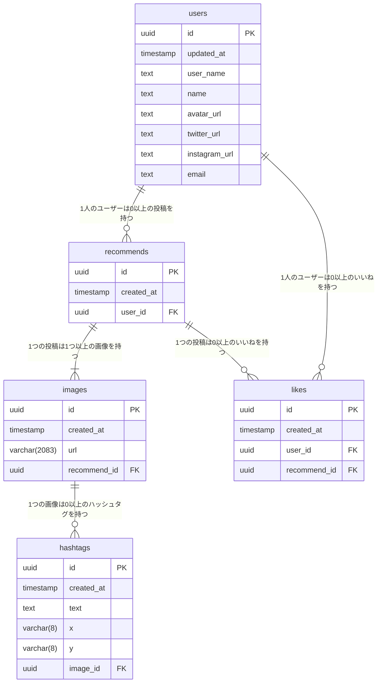

# My recommend

## 概要

Instagramを写真を共有するアプリケーションです。  
Instagramにあるような写真投稿、いいね、検索機能に加えて、ソートやハッシュタッグを写真上に表示する機能があります。


- 検索、ソート  

https://user-images.githubusercontent.com/51901346/225002538-6d0a45b8-2453-4a46-873c-e5d8533ca46a.mp4

- 写真投稿

https://user-images.githubusercontent.com/51901346/225002575-3ab753a9-d995-4ec3-955b-40b7b5d91995.mp4


## 機能一覧
- 写真、ハッシュタグ投稿
- いいね
- 検索
- ソート

## 実装予定機能
- 複数写真投稿
- 編集
- 削除
- ハッシュタグカラー変更

## 環境構築

```bash
# クローン
$ git clone https://github.com/xyytgae/my-recommend.git

# パッケージインストール
$ yarn

# localhost:3000でサーバー立ち上げ
$ yarn dev
```

## 技術
- Nuxt.js
- Vuetify.js
- Supabase
- GraphQL

## 開発中によく使うコマンド
```bash
# git czを使用しgit commitを行う
$ yarn commit

# GraphQLの型を生成
$ yarn codegen

# Supabaseから型を生成
$ yarn supabase:types
```


## ER図



## ディレクトリ構成

```
.
├─apis // コントローラー
├─assets
├─components  // 使い回すコンポーネント
├─config  // envファイル
├─fragments  // apiに直接アクセス可能な使い回さないコンポーネント
├─graphql  // GraphQLのquery、mutation
├─layouts
├─middleware
├─modules  // 共通関数
├─pages
├─plugins
├─public
│  └─images
├─sql  // セットアップSQL
├─src
│  └─gql  // 自動生成したGraphQLの型
├─store  // 状態管理
└─types  // 手動で作成した型、自動生成したSupabaseの型

```